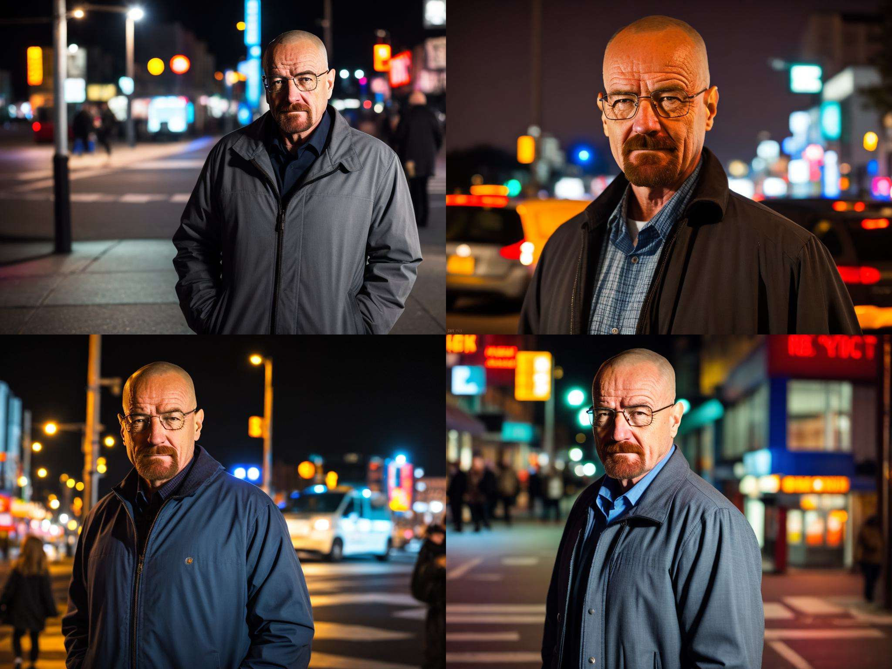
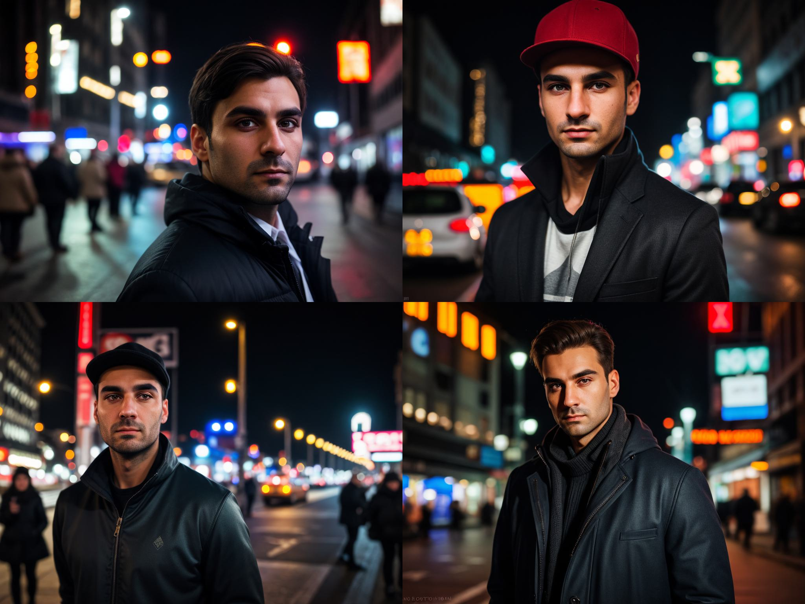
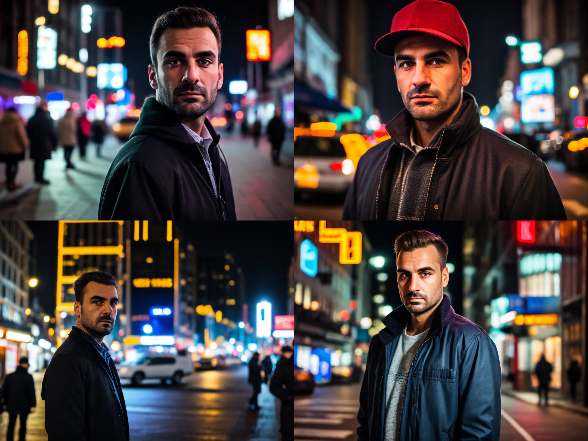
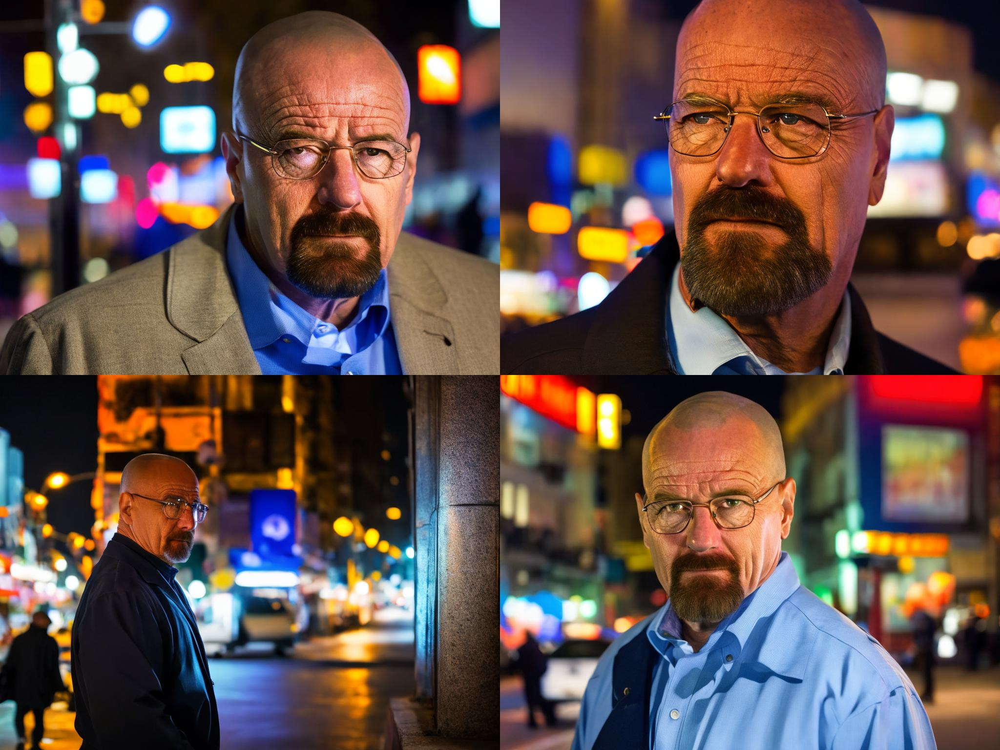
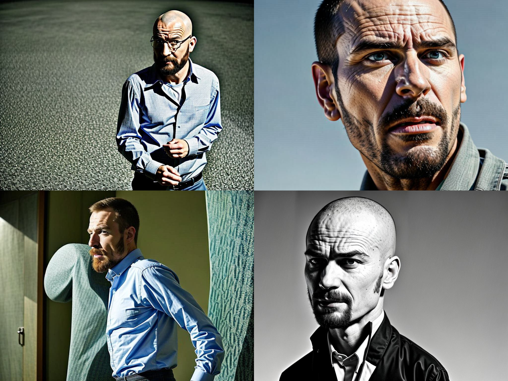
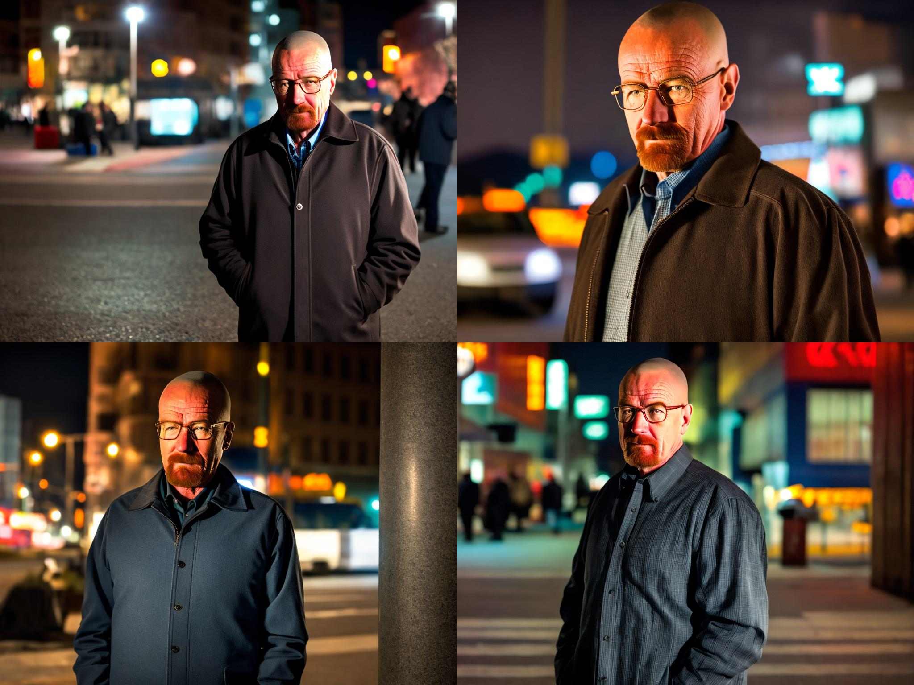
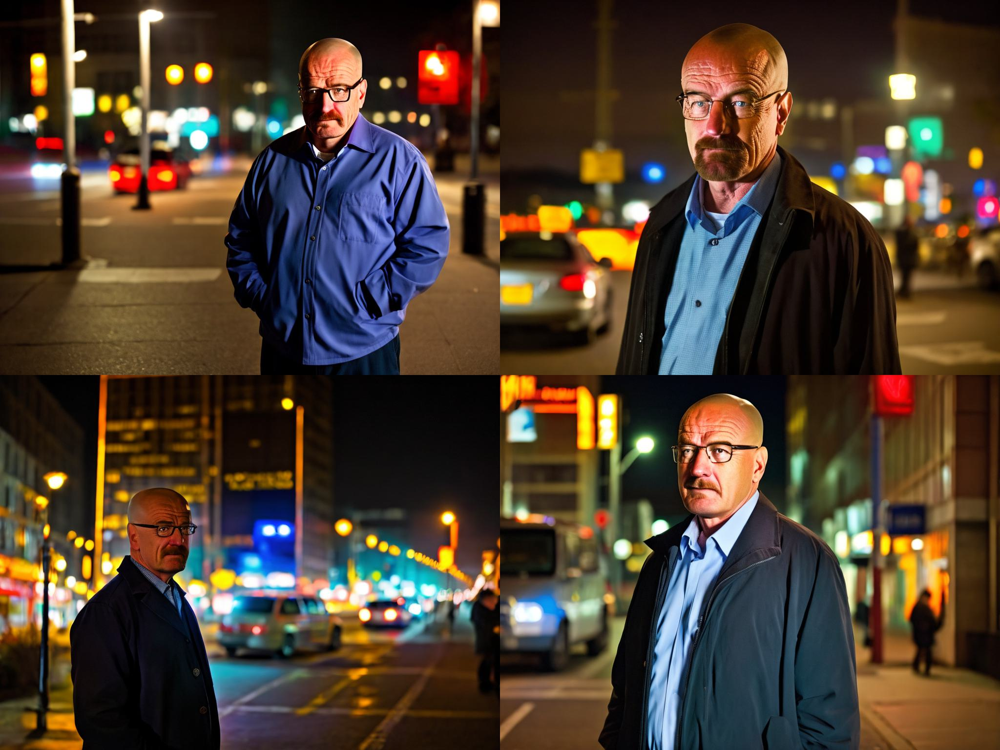

# ДЗ № 4

#### Даняев Артем Андреевич

## Результаты обучения

Все сгенерированные изображения (по 4 изображения для каждого из 5 зафиксированных для сравнения промптов для всех экспериментов) находятся в папке ./gen_images

Для обучения модели собрал датасет из 18 изображений с Уолтером Вайтом из сериала Breaking Bad

### Обучение StableDiffusion 1.5 методом Dreambooth

После обучения методом Dreambooth получаем генерации достаточно хорошего качества

### Обучение Stable Diffusion методом Dreambooth Lora
   #### lr=2e-6 rank=4
   
  
  
  Можно заметить, что с дефолтными параметрами модель практически не обучилась под выбранного персонажа. Попробуем постепенно увеличивать learning rate.
  
  #### lr=2e-5 rank=4
  

  #### lr=2e-4 rank=4
  

  #### lr=2e-3 rank=4
  

  Как можно увидеть, с learning rate = 2e-3 модель уже слишком сильно переобучилось, оптимальное качество генерации было достигнуто при learning rate = 2e-4, зафиксируем его и проведем эксперименты с параметром rank.

  #### lr=2e-4 rank=8
  

  После увеличения rank до 8, качество генерации визуально ухудшилось. Попробуем уменьшить rank до 2

  #### lr=2e-4 rank=2
  

  С уменьшенным rank = 2 качество генерации также ухудшилось, таким образом, лучшие результаты были достигнуты с параметрами learning rate = 2e-4  и rank = 4

  Сравнивая результаты Dreambooth и Lora Dreambooth, можно сказать, что качество генерации немного лучше у Dreambooth, что и следовало ожидать.

### Controlnet Canny-edge

  Выбранные референсные изображения:
  
  

  

  #### Результаты Dreambooth c Controlnet Canny-edge

  

  

  #### Результаты лучшего эксперимента Dreambooth Lora c Controlnet Canny-edge

  

  

  
