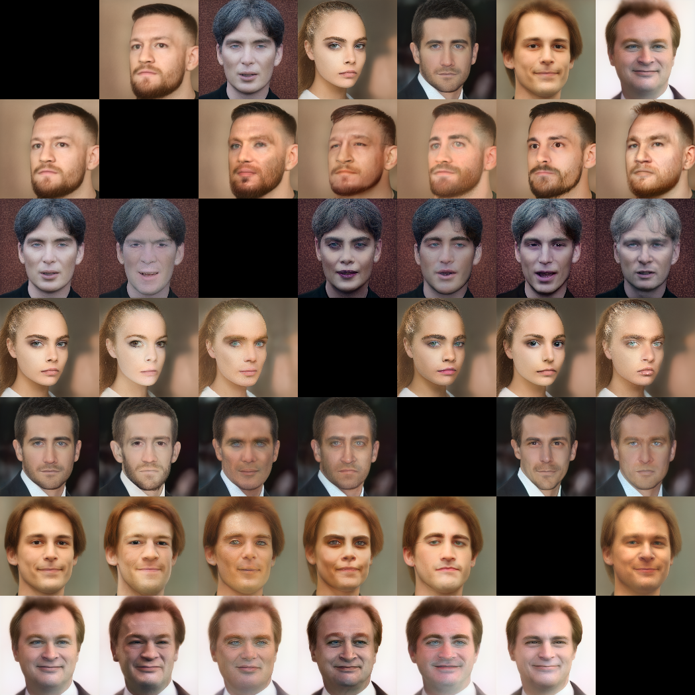

# ДЗ №3

#### Даняев Артем Андреевич

## Результаты работы
  ### Projection of real images
  Сначала находим вектор с помощью модели Encoder4Editing, затем дополнительно улучшаем его с помощью оптимизации лоссов Lpips_loss, Reg_loss, Rec_loss
  
  

  ### Style transfer
  Применим Styles crossover для добавления стилей к лицам актеров
   #### Стиль 1
   
   
   #### Стиль 2
   
   
   #### Стиль 3
   
   

  ### Expression transfer
  Применим интерполяцию для редакцирования лиц актеров
  
   * Возраст
     
      

   * Положение лица

      

   * Улыбка

      

   * Злость

      
      
      
     
  ### Face swap
   
  Замена лица с помощью arcface loss. В ходе экспериментов подбирал оптимальные коэффициенты лоссов

  По строкам - изначальные лица, по столбцам - накладываемые лица

  

   

  

